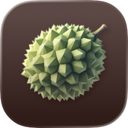

<p align="center">
  
</p>

<h1 align="center">Durian</h1>

<p align="center">
  A macOS email client for power users. Vim-style navigation, mbsync + notmuch backend.
</p>

---

## Structure
```
gui/    # Swift macOS app
cli/    # Go backend (IPC wrapper for notmuch/mbsync)
specs/  # Feature specs
agents/ # OpenCode agents
```

## Prerequisites
```bash
brew install isync notmuch
```

## Build
```bash
make              # build both
make build-cli    # CLI only
make dev          # CLI + open Xcode
make install      # install CLI to /usr/local/bin
make test         # run tests
```

## Keyboard Shortcuts

| Key | Action |
|-----|--------|
| `j` / `k` | Next / Previous |
| `gg` / `G` | First / Last |
| `Ctrl+d` / `Ctrl+u` | Page down / up |
| `s` | Toggle pin |
| `u` | Toggle read |
| `/` | Search |
| `q` | Close |

Custom keymaps: `~/.config/durian/keymaps.toml`

## CLI

```bash
durian search "tag:inbox" --limit 10
durian show <thread-id>
durian tag "tag:inbox" +archived -unread
durian auth login you@company.com
durian auth status
```

## Config

`~/.config/durian/config.toml`

- [docs/config-example.toml](docs/config-example.toml) – Full config example
- [docs/OAUTH_SETUP.md](docs/OAUTH_SETUP.md) – OAuth setup for Gmail/Microsoft
- [gui/docs/SYNC_SETUP.md](gui/docs/SYNC_SETUP.md) – mbsync/notmuch setup

